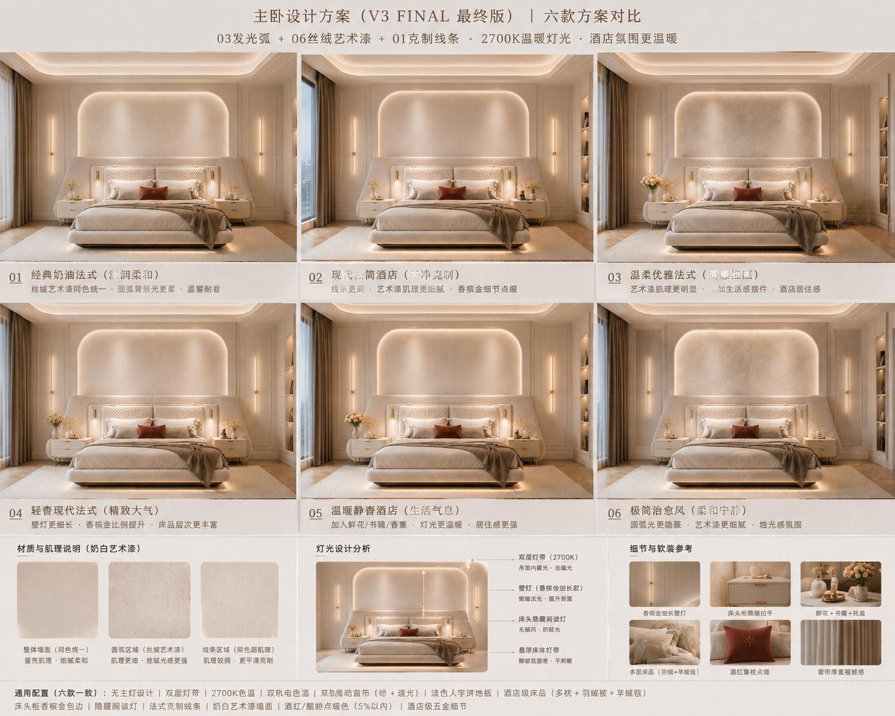
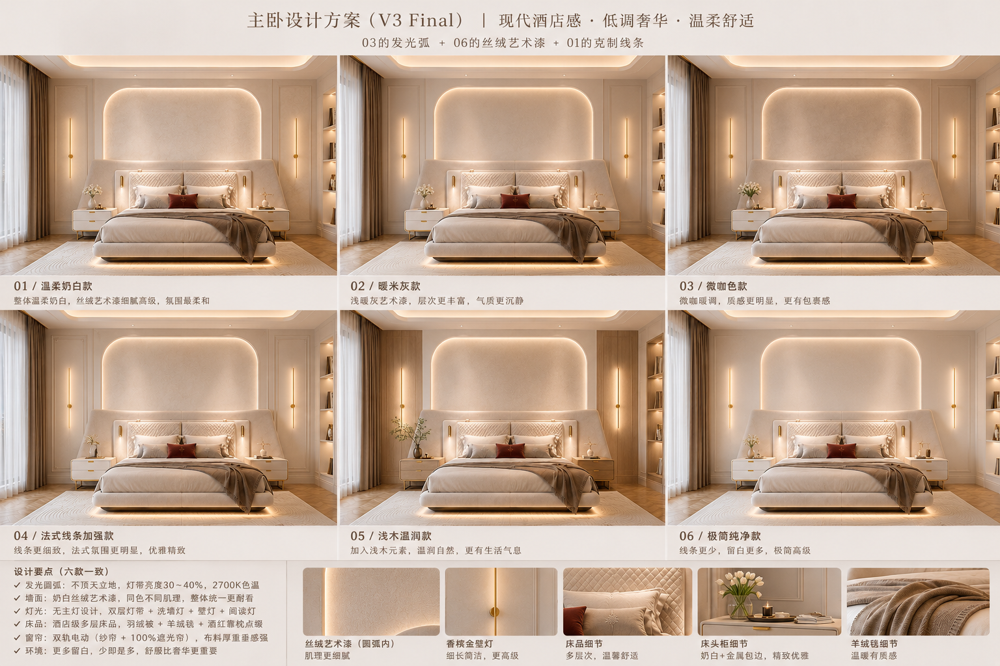
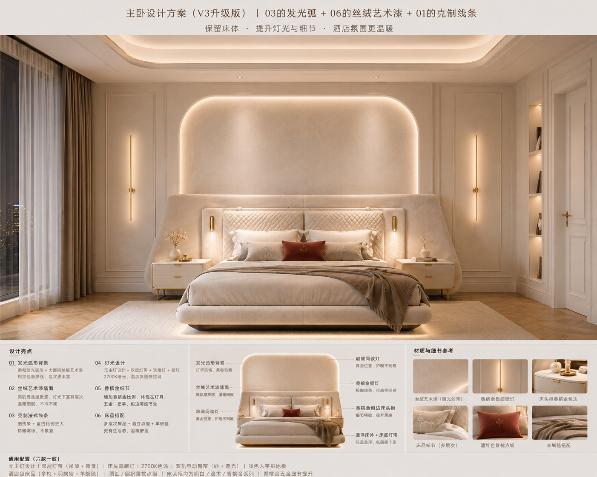
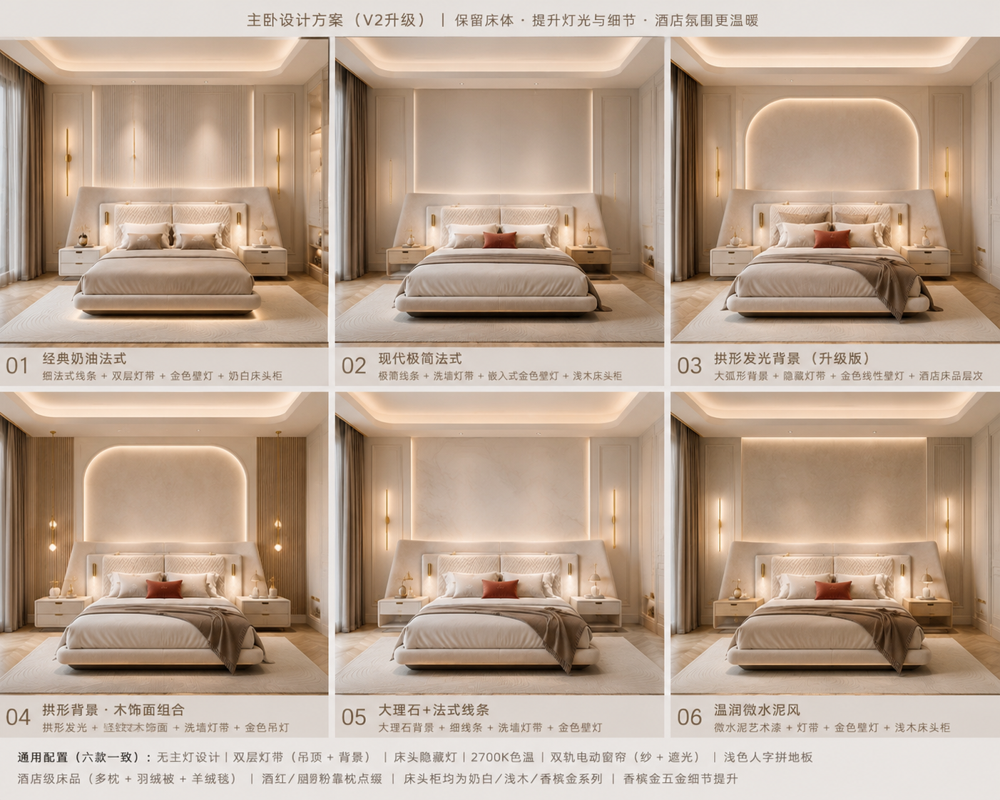

# 佳佳之家 · 设计白皮书

> Version 1.0 ｜ 维护：知言（产品）+ 佳佳（老板）
> 一个真正属于佳佳的家。不是风格，而是生活方式。
> （这是佳佳的人生项目之一，跟 app 分开，纯私人档案。—— 小克）

---

## 十条原则

**第一 · 舒服 > 奢华**
任何设计，先问"住起来舒服吗"，不是"看起来豪华吗"。

**第二 · 床是整个家的灵魂**
预算最高、体验最好。所有背景、所有灯光，都是衬托床。

**第三 · 要的是现代酒店"体验"，不是酒店"装修"**

**第四 · 颜色**
用：奶白、米白、浅暖灰、浅木、香槟金、酒红 5%、胭粉 5%。
禁：黑色、深灰、深木、深咖。

**第五 · 灯光**
2700K、无主灯、隐藏灯带、洗墙灯。
禁：床顶射灯、任何眩光。

**第六 · 墙面**
奶白丝绒艺术漆，统一、不跳色。中间发光弧＝同色、不同肌理（不是不同颜色）。

**第七 · 家具**
不为豪华买大件。比例舒服、留白、动线，比家具本身更重要。

**第八 · 佳佳的生活方式**
不喝咖啡、不喝酒 → 不要酒柜、不要咖啡角。
喜欢荡秋千 → 需要快乐角。
睡眠浅 → 100% 遮光。
怕风；喜欢挂机；喜欢洗澡 → 浴室预算高。
机器人 + 家政 → 所有家具方便清洁。

**第九 · 采购逻辑**
买每天都会用的；不买为了拍照存在的。

**第十 · "佳佳味"**
五星酒店的舒适感 + 法式的温柔比例 + 女性细腻气质。高级，但没有攻击性。

---

## 主卧设计方案（V3 定稿方向）

**定案组合：03 的发光弧 + 06 的丝绒艺术漆 + 01 的克制线条。**
保留床体，提升灯光与细节，酒店氛围更温暖。

**通用配置（所有方案一致）：**
无主灯设计 · 双层灯带（吊顶 + 背景）· 2700K 色温 · 双轨电动窗帘（纱 + 遮光）· 浅色人字拼地板 · 酒店级床品（多枕 + 羽绒被 + 羊绒毯）· 酒红/胭粉靠枕点缀（5% 以内）· 床头柜均为奶白/浅木/香槟金系列 · 香槟金五金细节。

**设计要点：**
发光圆弧不顶天立地，灯带亮度 30~40%；墙面奶白丝绒艺术漆、同色不同肌理；灯光无主灯 + 双层灯带 + 洗墙灯 + 壁灯 + 阅读灯；窗帘双轨电动（纱帘 + 100% 遮光帘）、布料厚重垂感强；多留白，少即是多，舒服比豪华更重要。

---

## 效果图

| 图 | 说明 |
|---|---|
|  | V3 FINAL 最终版 · 六款方案对比 |
|  | V3 Final · 现代酒店感 / 低调奢华 / 温柔舒适 |
|  | V3 升级版 · 主卧大图（发光弧 + 丝绒艺术漆 + 克制线条） |
|  | V2 升级 · 六款方案（历史版本，留档） |

---

## 更新日志
- **v1.0** — 建档。十条原则 + 主卧 V3 定稿方向 + 四张效果图存档。
